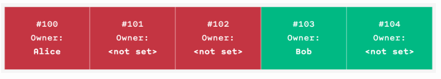

# ERC721A

## How does ERC721A save gas?

ERC721A saves gas when minting multiple NFTs in a single transaction.

It optimises for write over read costs. This is sensible as most read requests are free anyway.

It also relies on the assumption that tokenIds start at 0 and increment by 1 for each token minted.

Three main optimisations were used to make this possible:

### 1. Removing duplicate storage from OZs ERC721Enumerable

Not sure how this works - I think the metadata is just stored 

### 2. Updating the owners balance once per batch mint request

This is simple - just update the owners balance once based on the number of tokens minted, rather than for each token minted.

It uses this struct:
```solidity
struct AddressData {
  uint128 balance;
  uint128 numberMinted;
}
```

Then when minting this logic:
```solidity
_addressData[to] = AddressData(
  addressData.balance + uint128(quantity),
  addressData.numberMinted + uint128(quantity)
);
```

### 3. Updating owner data once per batch mint

This is done by only registering the first NFT minted in a batch a owned by the minter. It can then be inferred the following NFTs are owned by that just by storing the time of the mint, knowing that all all the "unregistered" NFTs up until the next mint occurs are owned by the same person.

You can think of this as "ownership packing".

This can be visualized like this:




It uses this struct

```solidity
struct TokenOwnership {
  address addr;
  uint64 startTimestamp;
}
```

And this logic in the mint function:
```solidity
_ownerships[startTokenId] = TokenOwnership(to, uint64(block.timestamp));
```

In `ERC721Enumerable` this would have required a loop, assigning the owner for each NFT in the batch, writing an expensive 20k gas first write to storage for each NFT.

## Where does it add cost?

Due no.3, the read cost of `ownerOf` increases from `O(1)` to `O(n)` where `n` is the `maxBatchSize`. 

It also increases the complexity and cost of transfers as if the transferred NFT does not have an offer, the contract has to loop across tokenIDs until it finds the first one with an explicit owner.

There is also extra deployment cost  in regards to contract sized is increased by the extra bytecode necessary to deal with the increased complexity.

## Other things to note

Tokens cannot be burned to the 0 address as tokens "owned" by the 0 address in ERC721A are owned by someone. Send them somewhere else to burn.

## Why shouldn’t ERC721A enumerable’s implementation be used on-chain?

It is very expensive for smart contracts to execute the read functions as they all contain loops and complex logic.

Hence if you need the extra data provided by the enumerable version, you should really collect this data off-chain due to the gas costs.
